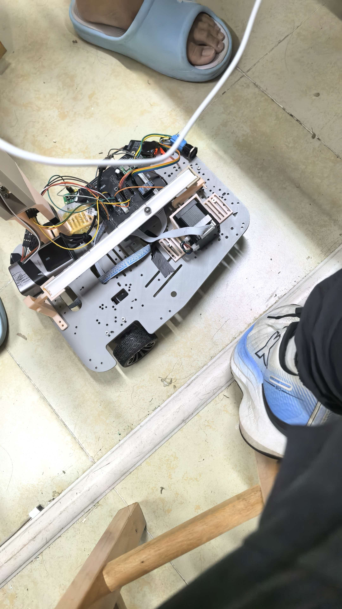

# k230-ball-balancer

K230 (CanMV) 钢珠平衡控制系统 —— OpenCV 视觉识别（≥60FPS）+ PID 控制 + Wi-Fi 网页图传

## 功能

1. OpenCV 识别钢珠（≥60FPS），PID 控制自动稳定，并响应串口多任务指令（任务 3/4/5/6）
2. 开启 Wi-Fi AP 热点（SSID: `GK-TFBOSS-ds`）
3. 浏览器访问 `http://192.168.169.1:8081` 查看实时灰度局部视频流，支持网页录像

## 控制原理

- 视觉识别：OpenCV 灰度阈值+轮廓检测提取钢珠，识别帧率 ≥60FPS，尺寸/像素/宽高比过滤反光与边缘误识别
- 控制算法：PID 位置控制，ROI 区域（800x480 画面中 40px 高凹槽带）
- 图传优化：仅截取中间 800x128 凹槽区域编码 MJPEG，节约带宽

## 运行环境

- 01Studio CanMV K230 开发板
- 固件：CanMV v1.8（含 `media.sensor` / `media.display` 模块）

## 参数速查

| 参数 | 值 |
|---|---|
| AP SSID | GK-TFBOSS-ds |
| 视频地址 | 192.168.169.1:8081 |
| JPEG 质量 | 35 |
| 目标帧率 | 15 FPS |
| 识别帧率 | ≥60 FPS |

## 文件结构

- `k230_ball_balancer.py` — 主程序（单文件，直接运行）
